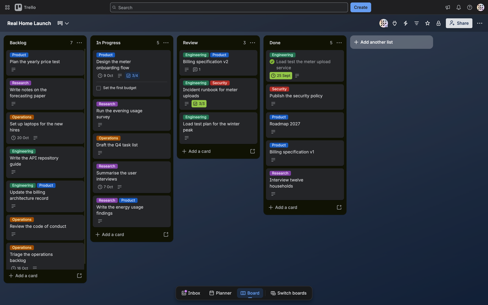

# Trello MCP

This repository is a Model Context Protocol (MCP) server for Trello. An agent uses its 52 tools to read and change boards, lists, cards, checklists, comments, labels and attachments. The server runs on the user's machine and talks to the agent over standard input and output (stdio). It calls the Trello web API with the user's key and token. Every reply is written for an agent, which reads each word of it and pays for each word in context.

Trello runs its own hosted MCP server, at `https://mcp.trello.com/v1`. That server cannot touch comments, and its support for checklists is limited, yet those are most of what a board is worth reading for. This server is a fork of `delorenj/mcp-server-trello`, taken at the tag `fork-point` on upstream commit `737292f` of 2026-09-15. The fork drops the server's health and repair tools, fixes the broken tools, and merges the four attachment tools into one. It adds label and search tools, card numbers, duplicate-safe batches, a workspace guard, trimmed replies and limits that refuse with a reason.

The server goes as far as one Trello account and the boards that the account can reach. It can archive a card or a list, but it cannot delete a card, a list or a board. It only responds to calls, so it does not react to changes made in Trello. The agent skill in `skills/trello-mcp/` tells an agent which tool to use and what to watch. An agent gets every reply trimmed to what it reads, and every refusal with its reason.

| What it covers | Where |
| --- | --- |
| **Boards and workspaces, and the active board** | `src/tools/boards.ts` |
| **Lists** | `src/tools/lists.ts` |
| **Cards, with card numbers, search and batches of up to 50** | `src/tools/cards.ts`, `src/trello/batch.ts` |
| **Comments** | `src/tools/comments.ts` |
| **Checklists and acceptance criteria** | `src/tools/checklists.ts`, `src/trello/checklists.ts` |
| **Attachments: links, local files and inline data** | `src/tools/attachments.ts`, `src/trello/attachments.ts` |
| **Labels and members** | `src/tools/labels.ts`, `src/tools/members.ts` |
| **Custom fields** | `src/tools/custom-fields.ts` |
| **Retries, the rate limit and the workspace guard** | `src/trello/client.ts`, `src/trello/rate-limiter.ts`, `src/trello/workspace-guard.ts` |
| **Trimmed replies and the markdown card** | `src/reply/` |
| **The agent skill** | `skills/trello-mcp/` |
| **Security policy** | `.github/SECURITY.md` |

 

## 1. Build and Run

    npm ci                                 # the exact versions in package-lock.json
    npm run build                          # compiles src/ into build/
    npm test                               # unit tests, and the smoke tests when .env names a test board
    npm start                              # the server on stdio, with the settings of section 1.1
    npm run typecheck
    npm run lint                           # ESLint and Prettier, as package.json sets them
    npm run format                         # rewrites src/ and tests/ to the Prettier style
    npm run test:unit                      # offline tests only
    npm run test:smoke                     # live tests only, section 1.3

The server needs Node.js 22 or later, and every other dependency is in `package.json`.

### 1.1 Settings

The server reads its settings from the environment when it starts. It reads no `.env` file itself, so the client that starts it must pass them. `example.env` lists each one with a comment. A limit with a value that is not a positive number stops the server at once, with the reason on standard error.

| Setting | Need | Effect |
| --- | --- | --- |
| **`TRELLO_API_KEY`** | required | The API key of a Trello app, from `https://trello.com/power-ups/admin`, as `example.env` describes. |
| **`TRELLO_TOKEN`** | required | The token of the same account, from the authorisation address in `example.env`. |
| **`TRELLO_BOARD_ID`** | optional | The first active board, section 3. |
| **`TRELLO_ALLOWED_WORKSPACES`** | optional | Workspace IDs, separated by commas. When set, the workspace guard of section 3 is on. |
| **`TRELLO_ATTACH_ROOT`** | optional | The one folder that a `file://` attachment may come from. When it is empty, every local upload is refused. |
| **`TRELLO_DESCRIPTION_LIMIT`** | optional | The most characters in a card description. The default is 2400. |
| **`TRELLO_MAX_DOWNLOAD_MB`** | optional | The largest file that `download_attachment` returns, in megabytes (MB). The default is 5. |
| **`https_proxy` or `HTTPS_PROXY`** | optional | A proxy for every call to Trello. |
| **`TRELLO_TEST_BOARD_ID`** | smoke tests only | The scratch board of section 1.3. |
| **`TRELLO_TEST_OTHER_BOARD_ID`**, **`TRELLO_TEST_WORKSPACE_ID`**, **`TRELLO_TEST_REFUSED_WORKSPACE_ID`**, **`TRELLO_TEST_REFUSED_BOARD_ID`** | smoke tests only, optional | A second board in the workspace of the scratch board, that workspace, another workspace, and a board in it. Each one turns on the move test or the workspace guard tests. |

### 1.2 Agent Connection

An MCP client starts the server as a child process. Most clients take an entry of this shape, in their configuration file:

    {
      "mcpServers": {
        "trello": {
          "command": "node",
          "args": ["/absolute/path/to/trello-mcp/build/index.js"],
          "env": {
            "TRELLO_API_KEY": "<your key>",
            "TRELLO_TOKEN": "<your token>"
          }
        }
      }
    }

Give the full path to `build/index.js`, because the client starts the server from a folder of its own. The entry holds the key and the token, so keep that file out of git, as this repository does with `.mcp.json`. The skill in `skills/trello-mcp/` goes to the agent as one folder. Link or copy that whole folder into the agent's skills folder, for example `~/.claude/skills/trello-mcp`.

### 1.3 Tests

The two suites answer different questions, and they live apart.

| Suite | Folder | Needs | Proves |
| --- | --- | --- | --- |
| **Unit** | `tests/unit/` | only `npm ci` | The code does what we think Trello expects. Every call goes to a mocked Trello. |
| **Smoke** | `tests/smoke/` | `TRELLO_API_KEY`, `TRELLO_TOKEN` and `TRELLO_TEST_BOARD_ID` in `.env`, and the optional test settings of section 1.1 | Trello accepts the calls. The suite starts `build/index.js` and calls its tools over MCP. |

The smoke suite skips itself when one of its three settings is absent, so `npm test` needs no Trello account. The smoke suite starts the built server, so `npm test` and `npm run test:smoke` run `npm run build` first. The unit suite runs against the source, and `npm run test:unit` does not build. A full smoke run took 96 seconds on 2026-09-30, and its search test can wait up to 5 minutes for Trello's search index.

GitHub Actions runs both suites, through the tests and smoke workflows in `.github/workflows/`. The tests workflow runs the typecheck, the lint, the build and the unit tests on Node.js 22 and 24. It runs on Blacksmith runners for each push to `main` and each pull request. A Dependabot pull request runs on GitHub-hosted runners. The smoke workflow runs the smoke suite on GitHub-hosted runners, after each push to `main`, every second Monday at 05:17 UTC, and on demand. It fails when a setting is absent, so a missing secret cannot give a green run with no tests.

The smoke workflow reads the key and the token from the secrets of the GitHub environment `smoke`. It reads the five test IDs from the variables of that environment. The environment admits the `main` branch alone, so a pull request from a fork never reaches the secrets. They belong to the test account `svc-trello-ci@brainquiver.ai`, which can reach only the test boards.

Dependabot checks the npm packages and the pinned actions once a month, and it opens a pull request for each update. A security advisory gets a pull request at once. A person merges each one, because nothing merges automatically.

CodeQL and the OpenSSF Scorecard check the security of the repository. The CodeQL workflow analyses the TypeScript, the JavaScript and the workflow files. It runs on each pull request, each push to `main` and every Monday, on the same runners as the tests. The Scorecard workflow scores the security practice of the repository after each push to `main` and every Monday. The Scorecard service requires GitHub's own runners for a published score. Both report to the Security tab, and `.github/SECURITY.md` gives the private way to report a vulnerability.

### 1.4 Server Checks

When an agent reports that the server is down, or that a tool is absent, take these steps in order.

1. Run `npm run build`. The client starts `build/index.js`, and a fresh clone has no `build/`.
2. Start the server by hand with the same settings as the client: `TRELLO_API_KEY=<key> TRELLO_TOKEN=<token> node build/index.js`.
3. A healthy server stays silent and waits for input. Stop it with Ctrl+C.
4. When it stops at once, read the line on standard error. It names the setting that is absent or wrong.
5. Check that the path in the entry of section 1.2 is absolute. Then restart the client, which reads its configuration only when it starts.
6. When every call fails with `Trello returned 401`, the token is wrong or revoked. Make a new token.
7. To see the tools and call one by hand, run the MCP Inspector: `npx @modelcontextprotocol/inspector node build/index.js`.

## 2. Directory Tree

    src/                    index.ts, which reads the settings and starts stdio, and server.ts, which registers the tools
    src/tools/              the tools, one file for each area, with their inputs and descriptions
    src/trello/             the calls to Trello: the client, retries, the guard, the batch and the checks
    src/reply/              what goes back to the agent: the reply helpers, the shapers, the markdown card
    tests/unit/             offline tests against a mocked Trello, one file for each source file
    tests/smoke/            live tests against the Trello web API, on a scratch board
    .github/workflows/      the tests, smoke, CodeQL and Scorecard workflows
    .github/dependabot.yml  the monthly update checks for the npm packages and the actions
    .github/SECURITY.md     the security policy, and the private way to report a vulnerability
    skills/trello-mcp/      the agent skill: SKILL.md, and every tool in references/tools.md
    docs/                   the roadmap and the assurance case
    docs/images/            the wide screenshot in this readme, and a square one
    build/                  the compiled server, which npm run build writes and git ignores

## 3. Concepts

Three terms carry the rest of this document.

| Concept | Meaning | Where |
| --- | --- | --- |
| **Active board** | The default board for any call that does not name one. It starts as `TRELLO_BOARD_ID`. `set_active_board` replaces it and saves the choice in `~/.trello-mcp/config.json` for later runs. | `src/trello/client.ts` |
| **Trimmed reply** | A reply cut to the fields that an agent reads, under Trello's own field names. The full reply adds plugin data, badges and display settings that cost context but rarely matter to an agent. `raw: true` on a read tool returns the full reply. | `src/reply/shape.ts` |
| **Workspace guard** | A check on every request when `TRELLO_ALLOWED_WORKSPACES` is set. It traces each request to its boards and each board to its workspace, and it refuses anything outside the allowed workspaces, personal boards included. | `src/trello/workspace-guard.ts` |

A `boardId` given beside a list or a card works as a check: the server refuses a list or a card on any other board.

## 4. Rules

Each rule states what to do, and its reason states what goes wrong otherwise.

| Rule | Reason |
| --- | --- |
| **Give every new tool a trimmed reply, through `json()` and a shaper in `src/reply/shape.ts`.** | A raw Trello reply is mostly identifiers and display data, and the agent pays for every word of it in context. |
| **Offer `raw: true` on read tools only.** | It lets an agent inspect a full object. A write returns the object that it changed, and the trimmed form confirms the change. |
| **Update the skill in the same commit as the tool.** | Agents rely on `skills/trello-mcp/references/tools.md` for every tool and input. A stale entry leads to calls that the server refuses, and `tests/unit/server.test.ts` fails when a row and the inputs of its tool differ. |
| **Add a call for every new tool to `tests/unit/server.test.ts`.** | That test is the only unit test that reaches a tool handler, and it fails for a tool without a call. |
| **Never retry a write after a server error or a lost reply.** | Trello may have completed the write before the failure, so a blind retry creates a duplicate. The interceptor in `src/trello/client.ts` retries a 429 for any request, and other failures for reads only. |
| **Add every new route to the workspace guard.** | The guard refuses a route that it cannot trace to a workspace. An unlisted route therefore fails whenever `TRELLO_ALLOWED_WORKSPACES` is set. |
| **Report every refusal as an `McpError` with its reason.** | `handleRequest` forwards an `McpError` unchanged and adds Trello's reason to any other error. Before this rule, refusals such as the 50-card batch limit reached the agent only as "An unexpected error occurred". |
| **Read local files only through the attach folder check.** | Card text can ask an agent to attach a key or a `.env` file, and every board member can read an attachment. The check in `src/trello/attachments.ts` resolves the real path, so a `../` or a symbolic link cannot escape `TRELLO_ATTACH_ROOT`. |
| **Run the smoke tests against a scratch board only.** | The suite creates, edits and archives real cards, checklists, comments and labels on the board in `TRELLO_TEST_BOARD_ID`. |
| **Remove a retired tool completely: its registration, shaper, tests, client method and row in `tools.md`.** | A part that stays is dead code, or a row that describes a tool that no longer exists. |
| **Port upstream fixes by hand.** | This fork splits upstream's single `index.ts` by area, so an upstream commit rarely applies unchanged. |

These commands show what upstream changed since the fork, and what this fork changed:

    git remote add upstream https://github.com/delorenj/mcp-server-trello.git
    git fetch upstream
    git log fork-point..upstream/main -- src/      # upstream work since the fork
    git diff fork-point..HEAD                      # all of our work since the fork

## 5. Tools and Replies

Each tool returns one reply, and the agent reads it as text. The table gives each form of reply.

| Reply | Form |
| --- | --- |
| **Success** | Compact JavaScript Object Notation (JSON), trimmed. A few tools confirm in plain words, as `success`. |
| **Success with `raw: true`** | Trello's full JSON reply. |
| **`get_card` with `includeMarkdown: true`** | The card as markdown. Markdown wins when `raw` is also set. |
| **`download_attachment`** | An image as MCP image content, and any other file as base64 in JSON. |
| **Failure** | `isError` is true, and the text is `Error: MCP error <code>: <reason>`. |
| **Batch stop** | `isError` is true, and the first sentence names the cards made and the cards not made. |

The code in a failure says which side was wrong.

| Code | Meaning |
| --- | --- |
| **-32602** | The input is wrong, or a check refused it: a limit, a board check or the workspace guard. |
| **-32600** | An attachment source is wrong, or the attach rules refused it. |
| **-32603** | Trello or the network failed. The reason follows, as `Trello returned 404: card not found`. |

The 52 tools, with every input of each, are in [skills/trello-mcp/references/tools.md](skills/trello-mcp/references/tools.md).

## 6. Limitations

| Limitation | Reason |
| --- | --- |
| **Cards, lists and boards cannot be deleted** | Trello cannot undo a deletion, while an archived card or list can be restored. |
| **A batch of cards is not all or nothing** | The Trello API does not support transactions, so the cards created before a failure remain on the board. The stop report names them. |
| **One Trello account for each server** | The key and the token authenticate a single account. A second account needs a second client entry. |
| **No live updates from Trello** | The server only responds to calls over stdio, and it does not use webhooks. |
| **Link attachments cannot be downloaded** | Trello stores the link alone, and the file stays at its source. |
| **Downloads are limited to 5 MB by default** | A download returns as base64 in the agent's context, about a third larger than the file. `TRELLO_MAX_DOWNLOAD_MB` changes the limit. |
| **Attachment links must use `https://` and a public address** | Plain HTTP can be read or altered in transit, and a private address exposes the local network. |
| **The workspace guard accepts workspace IDs only** | Trello identifies a board's workspace by its ID, so a workspace name in `TRELLO_ALLOWED_WORKSPACES` does not match. |
| **Custom fields must exist before a tool can set them** | No tool creates a custom field, so a person adds each field in Trello first. |
| **At most 100 calls in 10 seconds for each token** | Trello sets this limit, and the server queues calls to stay within it. |
| **A new card is absent from search for a few minutes** | Trello adds a new card to its search index after a delay, which was 2 to 4 minutes in the smoke tests. |
